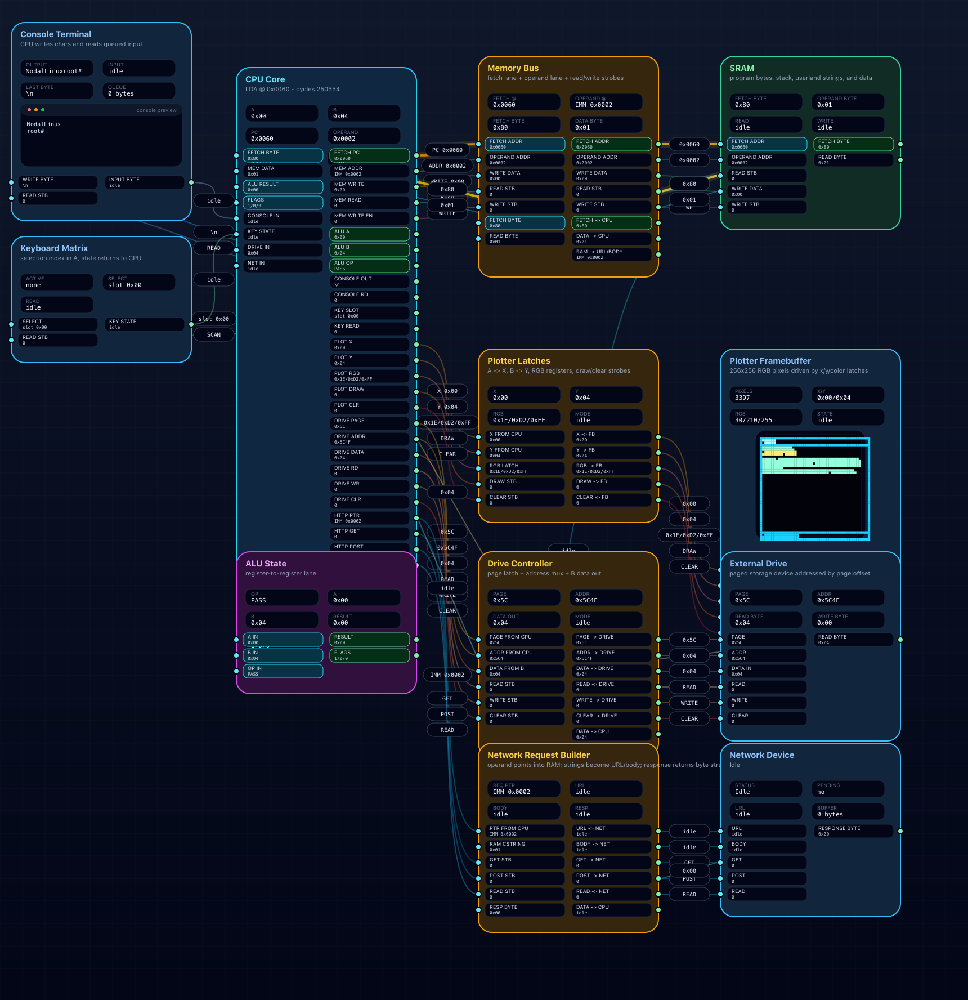

# Simulateur Logique Nodal

Made by **TheSamLePirate**.

A tiny, understandable computer laboratory in TypeScript.

Welcome to the classroom/laboratory/garage accident where we start with tiny electric lies called bits, wire them into logic, bully them into becoming an 8-bit computer, then make that computer run ASM, mini C, a bootloader, and a tiny Linux-like disk.

Yes, this is educational.
Yes, this is a little unhinged.
Yes, that is the correct amount of unhinged.

Inside the machine:

- start with transistors
- build up to logic gates
- reach a full 8-bit computer
- write ASM
- write mini C
- boot a tiny Linux-like disk

If you love C, you will probably love my mini C.
If you fear C, this may be the safest possible place to get bitten by it.

It is small, a little strict, a little retro, and just dangerous enough to teach you why buffer overflows were such a legendary hobby.

Some important tested truths about this mini C:

- integers are 8-bit unsigned and wrap around
- array parameters use copy-in / copy-back semantics, not normal C pointer aliasing
- strings are just zero-terminated buffers
- buffer overflows and deep recursion can still corrupt memory if you push too far

Remember when writing a single letter on screen was a small emotional crisis?

Remember when your biggest respectable number was `255`?

Remember when division was just repeated subtraction wearing a fake mustache?

And who even uses modulo anymore, except absolutely everyone the moment pixels, loops, counters, clocks, wraparound, or chaos show up?

## Why this repo is fun

- the VM is readable
- the computer is visual
- the bootloader is real
- the disk tools are real
- the mini C compiler is real, and it now does real code-size optimization to stay under the 4096-byte cap
- yes, it even has HTTP

This is basically a 1983 computer that drank too much coffee and learned TypeScript.

## Try it live

[puter.com/app/1983-computer](https://puter.com/app/1983-computer)

[1983-computer.puter.site](https://1983-computer.puter.site/)

## A few generated examples

`glxnano` running from the bootloader disk:


`Meteo Ales` rendered on the plotter:


Full computer architecture flow during a running Linux-like graphical example:



## Quick start

**Prerequisite:** Node.js

```bash
npm install
npm run dev
```

Then:

1. open the hardware scene if you want the transistor-to-CPU story
2. open the software side if you want to write code immediately
3. try a tiny C program
4. boot the bootloader
5. install the Linux disk
6. run weird little programs with joy

## Test and report

```bash
npm test
```

Test suite requirements:

- Node.js and npm
- `npm install` must have been run first
- a writable checkout, because `npm test` regenerates `src/content/generatedUserGuides.ts` and writes reports under `report/`
- the repository docs used by the pretest step must be present, especially `docs/userguide.md` and `docs/userguide.fr.md`

The `npm test` suite is OS-independent and does not require external command-line tools.
If `rsvg-convert` or ImageMagick `magick` are installed, some architecture-flow reports will also include PNG copies.
Without them, the suite still passes and still generates the SVG/JSON artifacts.

Optional PNG export helpers for architecture-flow reports:

- check whether one is available with `rsvg-convert --version` or `magick -version`
- macOS with Homebrew:
  `brew install librsvg`
  or
  `brew install imagemagick`
- Debian / Ubuntu:
  `sudo apt install librsvg2-bin`
  or
  `sudo apt install imagemagick`
- Fedora:
  `sudo dnf install librsvg2-tools`
  or
  `sudo dnf install ImageMagick`
- Windows:
  easiest option for `magick`:
  `winget install -e --id ImageMagick.ImageMagick`
  or install ImageMagick from the official Windows binary release and make sure `magick` is on your `PATH`
- Windows with Chocolatey:
  `choco install imagemagick`
- Windows with MSYS2 for `rsvg-convert`:
  `pacman -S mingw-w64-ucrt-x86_64-librsvg`
  then add `C:\msys64\ucrt64\bin` to your `PATH`

Verified references:

- [Homebrew `librsvg`](https://formulae.brew.sh/formula/librsvg)
- [Homebrew `imagemagick`](https://formulae.brew.sh/formula/imagemagick)
- [Debian `librsvg2-bin`](https://packages.debian.org/trixie/librsvg2-bin)
- [Debian `imagemagick`](https://packages.debian.org/stable/imagemagick)
- [Fedora `librsvg2-tools`](https://packages.fedoraproject.org/pkgs/librsvg2/librsvg2-tools)
- [Fedora `ImageMagick`](https://packages.fedoraproject.org/pkgs/ImageMagick/ImageMagick)
- [ImageMagick install docs](https://imagemagick.org/script/install-source.php)
- [ImageMagick Windows binaries](https://imagemagick.org/archive/windows/)
- [WinGet install command docs](https://learn.microsoft.com/en-us/windows/package-manager/winget/install)
- [Chocolatey `imagemagick`](https://community.chocolatey.org/packages/imagemagick)
- [MSYS2 `mingw-w64-ucrt-x86_64-librsvg`](https://packages.msys2.org/package/mingw-w64-ucrt-x86_64-librsvg)
- [ImageMagick Windows binary release notes](https://legacy.imagemagick.org/script/download.php)

Then open:

```text
report/index.html
```

You get one test dashboard with:

- all suites
- console output
- plotter snapshots
- computer architecture snapshots as SVG + PNG
- full-computer snapshots for bootloader/Linux runs
- one architecture snapshot for every bundled C example
- animated previews for multi-frame programs

Testing policy for this project:

- everything the user can run on the computer must be covered by automated tests
- every example program must be tested through multiple real workflows when possible, not just one isolated path
- in practice that means direct CPU execution and architecture-flow coverage must stay in sync for bootloader/Linux userland programs
- for this repository, that is what "100% test coverage" means

## Docs

- [Easy user guide](docs/userguide.md)
- [How the hardware works](docs/how-the-hardware-works.md)
- [How the computer works](docs/how-the-computer-works.md)
- [Mini C guide](docs/c-language-guide.md)
- [Compiler bugs and tests](docs/compiler-bugfixes-and-tests.md)

## Gentle warning

Issues will not be laughed at.

They will be welcomed, appreciated, and only laughed at **with affection** if the bug is especially creative.

## Repo

[github.com/TheSamLePirate/Simulateur-Logique-Nodal](https://github.com/TheSamLePirate/Simulateur-Logique-Nodal)

---

# Version française

# Simulateur Logique Nodal

Créé par **TheSamLePirate**.

Un petit laboratoire d'informatique compréhensible écrit en TypeScript.

Bienvenue dans ce cours de sciences un peu douteux où l'on part de petits mensonges électriques appelés bits, on les visse ensemble à coups de logique, on les menace gentiment jusqu'à ce qu'ils deviennent un vrai petit ordinateur 8 bits, puis on lui fait exécuter de l'ASM, du mini C, un bootloader et un petit disque façon Linux.

Oui, c'est pédagogique.
Oui, c'est légèrement inquiétant.
Oui, c'est exactement le bon niveau d'inquiétude.

À l'intérieur de la machine :

- on commence par les transistors
- on monte jusqu'aux portes logiques
- on arrive à un vrai ordinateur 8 bits
- on écrit de l'ASM
- on écrit du mini C
- on démarre un petit disque façon Linux

Si vous aimez le C, vous aimerez probablement mon mini C.
Si vous avez peur du C, c'est probablement l'endroit le plus sûr pour vous faire mordre par lui.

C'est petit, un peu strict, un peu rétro, et juste assez dangereux pour vous rappeler pourquoi les buffer overflows ont longtemps été un mode de vie.

Quelques verites importantes confirmees par les tests sur ce mini C :

- les entiers sont en 8 bits non signes avec overflow modulo 256
- les parametres tableau utilisent une semantique copie aller / copie retour, pas un aliasing pointeur classique du C
- les strings sont juste des buffers termines par `0`
- les buffer overflows et la recursion trop profonde peuvent encore corrompre la memoire si on pousse trop loin

Vous vous souvenez de l'époque où afficher une seule lettre à l'écran relevait déjà du combat de boss ?

Vous vous souvenez quand votre plus grand nombre sérieux, adulte, responsable, c'était `255` ?

Vous vous souvenez quand une division, au fond, c'était juste une soustraction répétée avec beaucoup d'aplomb ?

Et puis franchement, qui utilise encore le modulo... à part absolument tout le monde dès qu'on touche à des pixels, des boucles, des compteurs, des horloges, des débordements ou au chaos en général ?

## Pourquoi ce dépôt est amusant

- la VM est lisible
- l'ordinateur est visuel
- le bootloader est réel
- les outils disque sont réels
- le compilateur mini C est réel
- oui, il y a même du HTTP

C'est en gros un ordinateur de 1983 qui a bu trop de café et découvert le TypeScript.

## Essayer en ligne

[puter.com/app/1983-computer](https://puter.com/app/1983-computer)

## Quelques exemples générés

`glxnano` lancé depuis le disque du bootloader :


`Meteo Ales` rendu sur le plotter :


Vue complète de l'architecture de l'ordinateur pendant un exemple graphique Linux-like en cours :


## Démarrage rapide

**Pré-requis :** Node.js

```bash
npm install
npm run dev
```

Ensuite :

1. ouvrez la scène matérielle si vous voulez l'histoire transistor-vers-CPU
2. ouvrez la partie logicielle si vous voulez coder tout de suite
3. essayez un petit programme en C
4. démarrez le bootloader
5. installez le disque Linux
6. lancez de petits programmes bizarres avec un bonheur tout à fait raisonnable

## Tests et rapport

```bash
npm test
```

Pré-requis pour la suite de tests :

- Node.js et npm
- `npm install` doit avoir été exécuté avant
- un dépôt accessible en écriture, car `npm test` régénère `src/content/generatedUserGuides.ts` et écrit les rapports dans `report/`
- les fichiers de documentation utilisés par l'étape `pretest` doivent être présents, en particulier `docs/userguide.md` et `docs/userguide.fr.md`

La suite `npm test` est indépendante de l'OS et ne dépend d'aucun utilitaire externe en ligne de commande.
Si `rsvg-convert` ou ImageMagick `magick` sont installés, certains rapports d'architecture incluront aussi des copies PNG.
Sans eux, la suite passe quand même et génère toujours les artefacts SVG/JSON.

Outils optionnels pour exporter aussi des PNG dans les rapports d'architecture :

- vérifiez leur présence avec `rsvg-convert --version` ou `magick -version`
- macOS avec Homebrew :
  `brew install librsvg`
  ou
  `brew install imagemagick`
- Debian / Ubuntu :
  `sudo apt install librsvg2-bin`
  ou
  `sudo apt install imagemagick`
- Fedora :
  `sudo dnf install librsvg2-tools`
  ou
  `sudo dnf install ImageMagick`
- Windows :
  option la plus simple pour `magick` :
  `winget install -e --id ImageMagick.ImageMagick`
  ou installez ImageMagick depuis la distribution binaire officielle Windows et vérifiez que `magick` est bien dans le `PATH`
- Windows avec Chocolatey :
  `choco install imagemagick`
- Windows avec MSYS2 pour `rsvg-convert` :
  `pacman -S mingw-w64-ucrt-x86_64-librsvg`
  puis ajoutez `C:\msys64\ucrt64\bin` dans le `PATH`

Références vérifiées :

- [Homebrew `librsvg`](https://formulae.brew.sh/formula/librsvg)
- [Homebrew `imagemagick`](https://formulae.brew.sh/formula/imagemagick)
- [Debian `librsvg2-bin`](https://packages.debian.org/trixie/librsvg2-bin)
- [Debian `imagemagick`](https://packages.debian.org/stable/imagemagick)
- [Fedora `librsvg2-tools`](https://packages.fedoraproject.org/pkgs/librsvg2/librsvg2-tools)
- [Fedora `ImageMagick`](https://packages.fedoraproject.org/pkgs/ImageMagick/ImageMagick)
- [Documentation d'installation ImageMagick](https://imagemagick.org/script/install-source.php)
- [Binaires Windows ImageMagick](https://imagemagick.org/archive/windows/)
- [Documentation WinGet pour `install`](https://learn.microsoft.com/en-us/windows/package-manager/winget/install)
- [Paquet Chocolatey `imagemagick`](https://community.chocolatey.org/packages/imagemagick)
- [Paquet MSYS2 `mingw-w64-ucrt-x86_64-librsvg`](https://packages.msys2.org/package/mingw-w64-ucrt-x86_64-librsvg)
- [Notes sur la distribution binaire Windows d'ImageMagick](https://legacy.imagemagick.org/script/download.php)

Puis ouvrez :

```text
report/index.html
```

Vous obtenez un tableau de bord de test avec :

- toutes les suites
- la sortie console
- les captures du plotter
- des captures d'architecture machine en SVG + PNG
- des captures "ordinateur complet" pour les runs bootloader/Linux
- une capture d'architecture pour chaque exemple C embarqué
- des aperçus animés pour les programmes à plusieurs images

Politique de test du projet :

- tout ce que l'utilisateur peut lancer sur l'ordinateur doit etre couvert par des tests automatiques
- chaque programme d'exemple doit etre teste via plusieurs workflows reels quand c'est pertinent, pas seulement par un chemin isole
- en pratique, cela signifie que l'execution directe CPU et la couverture architecture-flow doivent rester synchronisees pour les programmes bootloader/Linux userland
- dans ce depot, c'est cela que signifie "100% test coverage"

## Documentation

- [Guide utilisateur simple](docs/userguide.md)
- [Comment le matériel fonctionne](docs/how-the-hardware-works.md)
- [Comment l'ordinateur fonctionne](docs/how-the-computer-works.md)
- [Guide du mini C](docs/c-language-guide.md)
- [Bugs du compilateur et tests](docs/compiler-bugfixes-and-tests.md)

## Petit avertissement

Les issues ne seront pas moquées.

Elles seront accueillies, appréciées, et seulement taquinées **avec affection** si le bug est particulièrement inventif.

## Dépôt

[github.com/TheSamLePirate/Simulateur-Logique-Nodal](https://github.com/TheSamLePirate/Simulateur-Logique-Nodal)
