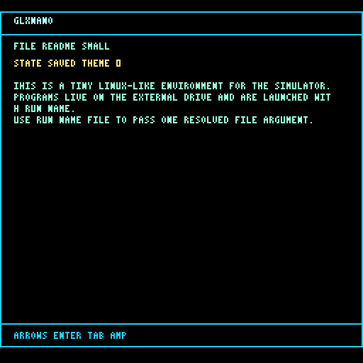
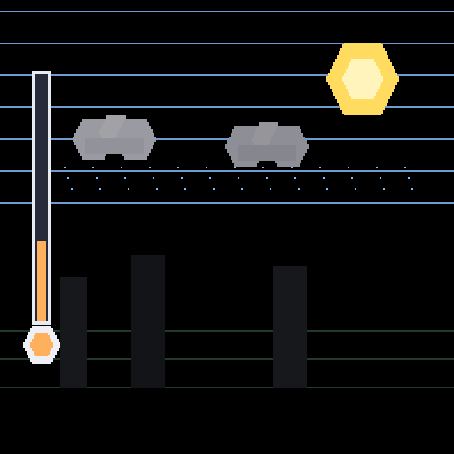

# Simulateur Logique Nodal

Made by **TheSamLePirate**.

A tiny, understandable computer laboratory in TypeScript.

Welcome to the classroom/laboratory/garage accident where we start with tiny electric lies called bits, wire them into logic, bully them into becoming an 8-bit computer, then make that computer run ASM, mini C, a bootloader, and a tiny Linux-like disk.

Yes, this is educational.
Yes, this is a little unhinged.
Yes, that is the correct amount of unhinged.

Inside the machine:

- start with transistors
- build up to logic gates
- reach a full 8-bit computer
- write ASM
- write mini C
- boot a tiny Linux-like disk

If you love C, you will probably love my mini C.
If you fear C, this may be the safest possible place to get bitten by it.

It is small, a little strict, a little retro, and just dangerous enough to teach you why buffer overflows were such a legendary hobby.

Remember when writing a single letter on screen was a small emotional crisis?

Remember when your biggest respectable number was `255`?

Remember when division was just repeated subtraction wearing a fake mustache?

And who even uses modulo anymore, except absolutely everyone the moment pixels, loops, counters, clocks, wraparound, or chaos show up?

## Why this repo is fun

- the VM is readable
- the computer is visual
- the bootloader is real
- the disk tools are real
- the mini C compiler is real
- yes, it even has HTTP

This is basically a 1983 computer that drank too much coffee and learned TypeScript.

## Try it live

[puter.com/app/1983-computer](https://puter.com/app/1983-computer)

## A few generated examples

`glxnano` running from the bootloader disk:



`Meteo Ales` rendered on the plotter:



## Quick start

**Prerequisite:** Node.js

```bash
npm install
npm run dev
```

Then:

1. open the hardware scene if you want the transistor-to-CPU story
2. open the software side if you want to write code immediately
3. try a tiny C program
4. boot the bootloader
5. install the Linux disk
6. run weird little programs with joy

## Test and report

```bash
npm test
```

Then open:

```text
report/index.html
```

You get one test dashboard with:

- all suites
- console output
- plotter snapshots
- computer architecture snapshots as SVG + PNG
- full-computer snapshots for bootloader/Linux runs
- one architecture snapshot for every bundled C example
- animated previews for multi-frame programs

## Docs

- [Easy user guide](docs/userguide.md)
- [How the hardware works](docs/how-the-hardware-works.md)
- [How the computer works](docs/how-the-computer-works.md)
- [Mini C guide](docs/c-language-guide.md)
- [Compiler bugs and tests](docs/compiler-bugfixes-and-tests.md)

## Gentle warning

Issues will not be laughed at.

They will be welcomed, appreciated, and only laughed at **with affection** if the bug is especially creative.

## Repo

[github.com/TheSamLePirate/Simulateur-Logique-Nodal](https://github.com/TheSamLePirate/Simulateur-Logique-Nodal)

---

# Version française

# Simulateur Logique Nodal

Créé par **TheSamLePirate**.

Un petit laboratoire d'informatique compréhensible écrit en TypeScript.

Bienvenue dans ce cours de sciences un peu douteux où l'on part de petits mensonges électriques appelés bits, on les visse ensemble à coups de logique, on les menace gentiment jusqu'à ce qu'ils deviennent un vrai petit ordinateur 8 bits, puis on lui fait exécuter de l'ASM, du mini C, un bootloader et un petit disque façon Linux.

Oui, c'est pédagogique.
Oui, c'est légèrement inquiétant.
Oui, c'est exactement le bon niveau d'inquiétude.

À l'intérieur de la machine :

- on commence par les transistors
- on monte jusqu'aux portes logiques
- on arrive à un vrai ordinateur 8 bits
- on écrit de l'ASM
- on écrit du mini C
- on démarre un petit disque façon Linux

Si vous aimez le C, vous aimerez probablement mon mini C.
Si vous avez peur du C, c'est probablement l'endroit le plus sûr pour vous faire mordre par lui.

C'est petit, un peu strict, un peu rétro, et juste assez dangereux pour vous rappeler pourquoi les buffer overflows ont longtemps été un mode de vie.

Vous vous souvenez de l'époque où afficher une seule lettre à l'écran relevait déjà du combat de boss ?

Vous vous souvenez quand votre plus grand nombre sérieux, adulte, responsable, c'était `255` ?

Vous vous souvenez quand une division, au fond, c'était juste une soustraction répétée avec beaucoup d'aplomb ?

Et puis franchement, qui utilise encore le modulo... à part absolument tout le monde dès qu'on touche à des pixels, des boucles, des compteurs, des horloges, des débordements ou au chaos en général ?

## Pourquoi ce dépôt est amusant

- la VM est lisible
- l'ordinateur est visuel
- le bootloader est réel
- les outils disque sont réels
- le compilateur mini C est réel
- oui, il y a même du HTTP

C'est en gros un ordinateur de 1983 qui a bu trop de café et découvert le TypeScript.

## Essayer en ligne

[puter.com/app/1983-computer](https://puter.com/app/1983-computer)

## Quelques exemples générés

`glxnano` lancé depuis le disque du bootloader :


`Meteo Ales` rendu sur le plotter :


## Démarrage rapide

**Pré-requis :** Node.js

```bash
npm install
npm run dev
```

Ensuite :

1. ouvrez la scène matérielle si vous voulez l'histoire transistor-vers-CPU
2. ouvrez la partie logicielle si vous voulez coder tout de suite
3. essayez un petit programme en C
4. démarrez le bootloader
5. installez le disque Linux
6. lancez de petits programmes bizarres avec un bonheur tout à fait raisonnable

## Tests et rapport

```bash
npm test
```

Puis ouvrez :

```text
report/index.html
```

Vous obtenez un tableau de bord de test avec :

- toutes les suites
- la sortie console
- les captures du plotter
- des captures d'architecture machine en SVG + PNG
- des captures "ordinateur complet" pour les runs bootloader/Linux
- une capture d'architecture pour chaque exemple C embarqué
- des aperçus animés pour les programmes à plusieurs images

## Documentation

- [Guide utilisateur simple](docs/userguide.md)
- [Comment le matériel fonctionne](docs/how-the-hardware-works.md)
- [Comment l'ordinateur fonctionne](docs/how-the-computer-works.md)
- [Guide du mini C](docs/c-language-guide.md)
- [Bugs du compilateur et tests](docs/compiler-bugfixes-and-tests.md)

## Petit avertissement

Les issues ne seront pas moquées.

Elles seront accueillies, appréciées, et seulement taquinées **avec affection** si le bug est particulièrement inventif.

## Dépôt

[github.com/TheSamLePirate/Simulateur-Logique-Nodal](https://github.com/TheSamLePirate/Simulateur-Logique-Nodal)
